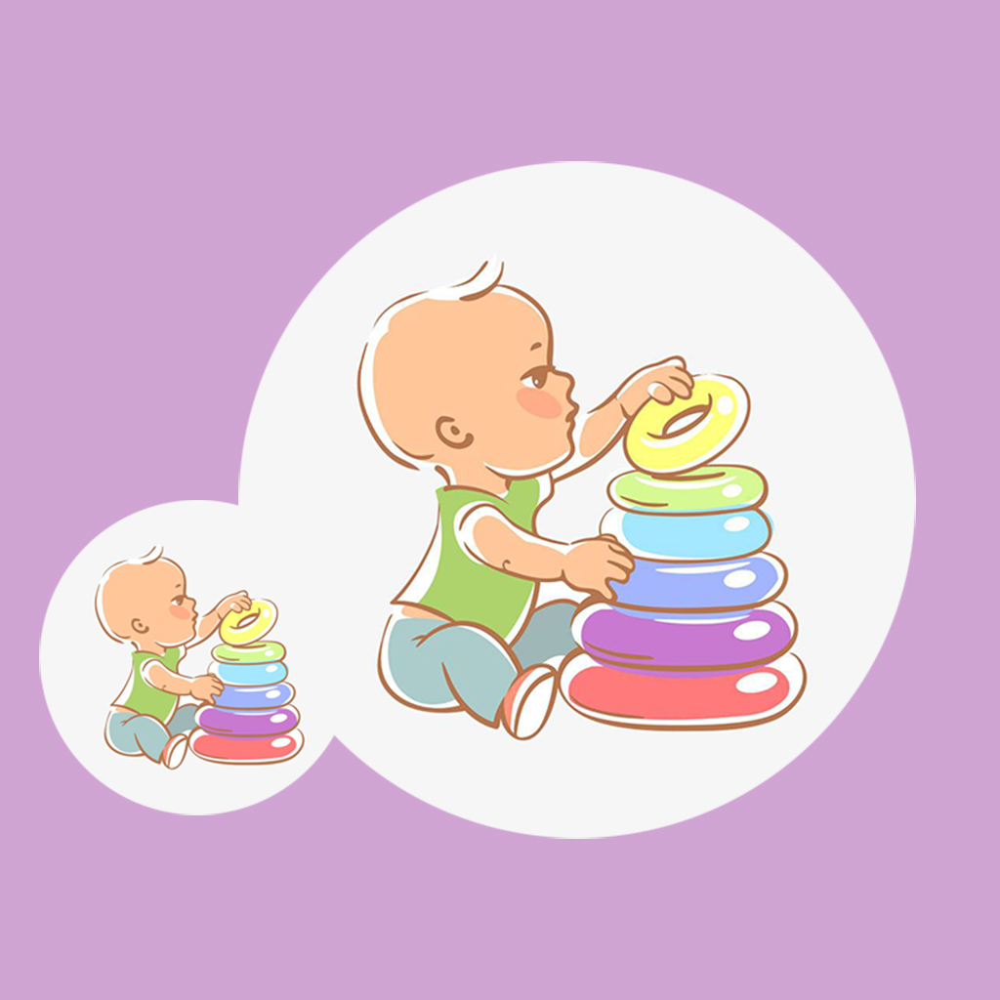

## Welcome to Baby Thinks Independently

This is a tool to help mothers and parents keep track of their babies' independent thinking exercises in their lives. The baby's ability to think things independently needs the care and help of parents. You can record your baby's independent thinking in daily life, the baby's mood changes and other information. You can also record your baby's independent thinking and achievements and share them with your baby and family to give your baby encouragement and confidence.

If you have any questions, you can either leave a message or send the questions to our email address.

We will answer them for you in the first time.

### Address: jichungan9498@163.com

Thank you!
